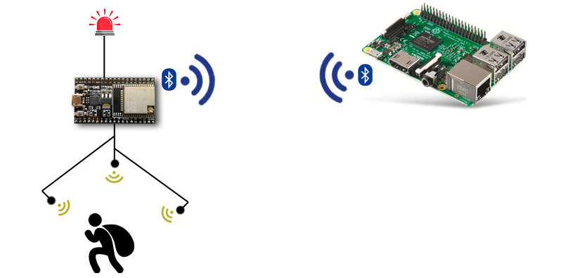
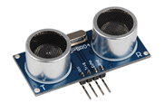
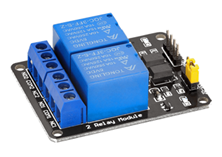
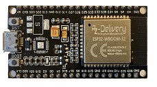
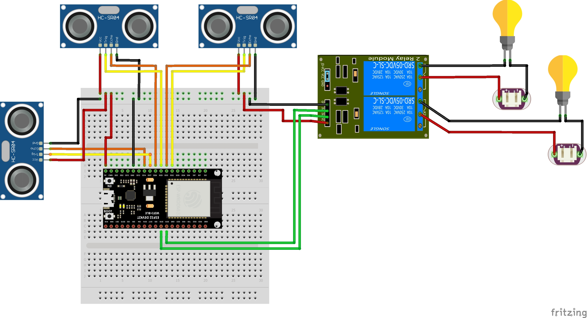

## Ultrasonic-Surveillance-System
### Arduino-based project using ultrasonic sensors to monitor areas with bidirectional communication and notification via Bluetooth. 
Ultrasonic sensors were deliberately chosen for this project. The range compared to infrared sensors is lower (0-3 meters), but they are more accurate and are not affected by sunlight or shading. The application area for this circuit is manifold. For example, an automatic light control when someone enters a certain area of the front yard. A garage door control. Two sensors are responsible for opening the door and on the other hand a third sensor detects the distance between garage wall and car and closes the door. 

### Spec:

* Ultrasonic surveillance system with 1 to 3
(HC-SR04) ultrasonic distance sensors to monitor a specific area (2 -
300cm).   

* If a change in distance is detected by one of the sensors, a 230V
relay (2-relay module 5V) should be switched active for a certain time. 

* An ESP32 microcontroller is used to control sensors and relays.
The firmware is written in C++ and contains the logic for processing sensor data,
switching relays and exchanging data via Bluetooth.  
 

* A Python client app running in a Linux environment (Raspberry PI) is responsible to
establish the connection to the ESP32 controller. The client should
transmit configuration parameters to the controller and receive sensor
data in real time from the controller. Received data (distance and relay
state) should be passed to the standard output and/or to a Telegram
chat.
  
* Configuration parameters are: Relays time span in milliseconds and
measuring range of the ultrasonic sensors in cm. The configuration is to
be stored permanently on the ESP32. Communication between ESP32 and client must be password protected.

### Breadboard sketch

* In the development phase the program Fritzing is used to create a sketch of the circuit.  

